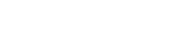

<h1 align="center">
    
</h1>

    

<h4 align="center">
    A web-based operating system that looks and feels like a real desktop environment.
</h4>

    <strong>
        <a href="https://webos.lima.zone/" target="_blank">Demo</a>
        •
        <a href="https://github.com/black-backdoor/WebOS">GitHub</a>
        •
        <a href="docs">Docs</a>
    </strong>

## Features
- **Static** - No server-side code, only client-side JavaScript, HTML, and CSS.
- **Progressive Web App** - Can be installed on your device and used offline.
- **Mobile & Desktop** - Works on both mobile and desktop, with support for touch and mouse input.
- **Adaptive** - enables & disables features based on supported Browser APIs.
- **Dark Mode** - Currently, the dark mode is the only mode available. 😁
<!-- - **Battery** - View the current battery status and charging state. -->
<!-- - **Display** - Can be open in another tab to make it look like a second monitor. -->
<!-- - **Light Mode** - Automatically switches to dark mode based on the system settings. -->
<!--- **Weather** - View the current weather and forecast for your location.-->
<!-- - **Notifications** -->
<!-- - **Apps** - File-Explorer, MP3. Player, Camera, Terminal, Notes -->

## License
This project is licensed under the GNU General Public License v3.0 - see the [LICENSE](LICENSE) file for details.

I know that developers don't like to read licenses, so here is a summary:
- You are free to use, modify and distribute this software.
- You must disclose the source code of your modified version.

[more info](https://choosealicense.com/licenses/gpl-3.0/)

**Make the source code public when making major changes, please. 🥺** (I would love to see what you have done with it.)
